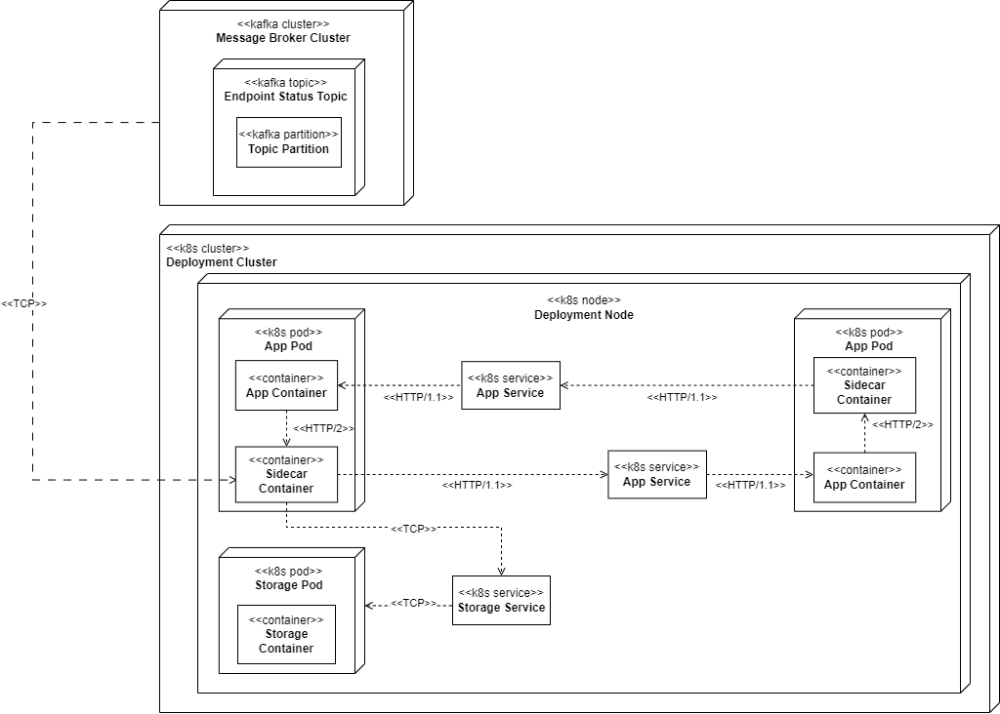

# Distributed Cascading Circuit Breaker (DCCB)
Improvement of the standard circuit breaker pattern in microservices to prevent calls to the open endpoints earlier. This is the final project of my undergraduate degree at the Bandung Institute of Technology.

## General Information
A standard circuit breaker only limits the call to the open endpoints of the service that knows the state. The main purpose of a distributed cascading circuit breaker (DDCB) is to broadcast the change in circuit breaker state to the first service in the chain of services. DCCB acts as a sidecar container that lives in the same pod as the service's pod. Furthermore, the DCCB can broadcast the change of state to all the services that need to call the endpoint, regardless of the number of service replicas and the node where their pods live. This was tested in a local Kubernetes environment. Because of the complexity of possible microservice architectures, DCCB has not handled the service orchestration yet.

## Technologies Used
Go, Gokit, gRPC, Apache Kafka, Apache KvRocks, Docker, Kubernetes

## Features
* Broadcast the change of circuit breaker state to all needed services
* Add exception and alternative endpoints via config file

## Deployment Diagram

## Usage
* [Docker Image](https://hub.docker.com/repository/docker/daffarg/distributed-cascading-cb/general)
* [Example Kubernetes Deployment File](./example)

## Acknowledgements
This project was inspired by https://github.com/naufal-dean/ccb

## Contact
Feel free to contact me at argakoesoemahmdaffa@gmail.com
